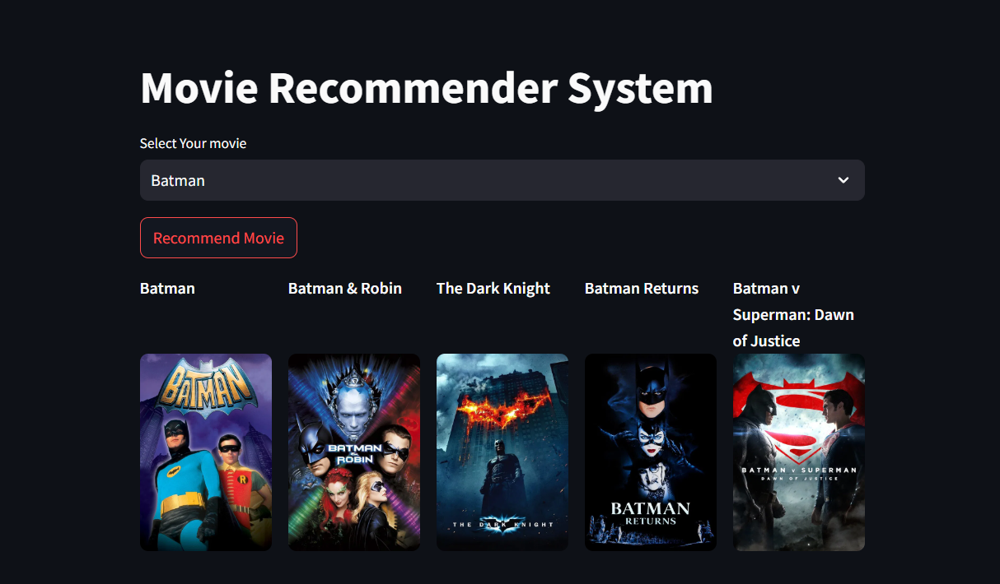

<p align="center">
    
</p>

<p align="center"><h1 align="center">Hybrid Content-Based Movie Recommender</h1></p>
<p align="center">
	<em>A sophisticated movie recommendation system that balances metadata and semantic plot similarity for nuanced and diverse suggestions.</em>
</p>
<p align="center">
	
	
	
	
</p>
<br>

## 📋 Table of Contents

- [Overview](#-overview)
- [Key Features](#-key-features)
- [Methodology](#-methodology)
- [Project Structure](#-project-structure)
- [Getting Started](#-getting-started)
  - [Prerequisites](#-prerequisites)
  - [Installation](#-installation)
  - [Usage](#-usage)
- [Project Roadmap](#-project-roadmap)
- [Contributing](#-contributing)
- [License](#-license)
- [Acknowledgments](#-acknowledgments)

---

## 🎯 Overview

This project provides a robust, content-based movie recommendation system that goes beyond simple keyword matching. The core of the application is a **hybrid similarity model** that intelligently blends two distinct types of features:

1.  **Explicit Metadata:** Attributes like genre, cast, director, and keywords.
2.  **Semantic Plot Meaning:** The deep, contextual understanding of a movie's narrative.

This dual-feature approach allows the system to generate recommendations that are not only relevant but also diverse and interesting, avoiding common pitfalls like recommending a list of movies that all star the same actor. The model's behavior can be fine-tuned using a weighted `alpha` parameter, making it adaptable to different types of films.

---

## ✨ Key Features

❯ **Dual-Feature Representation:** Combines sparse TF-IDF vectors for metadata with dense Sentence Transformer embeddings for plot semantics.

❯ **Tunable Hybrid Model:** Implements a weighted average (`alpha` parameter) to control the influence of metadata vs. plot similarity, allowing the model's "taste" to be customized.

❯ **Advanced Diversity Evaluation:** Employs the **Intra-List Similarity (ILS)** metric to quantitatively measure recommendation diversity and diagnose model behavior.

❯ **Data-Driven Analysis:** Includes a detailed analysis notebook demonstrating how different `alpha` values affect recommendation quality for various films, from genre-driven blockbusters to thematically complex dramas.

---

## 🛠️ Methodology

The recommendation engine is built on a three-stage pipeline:

1.  **Feature Extraction:**
    - **Metadata:** A text corpus is created for each movie from its `genres`, `keywords`, `cast`, and `crew`. Scikit-learn's `TfidfVectorizer` (with `max_features=3000`) converts this into a sparse matrix (`tfidf_matrix`).
    - **Semantics:** The powerful `all-MiniLM-L6-v2` Sentence Transformer model encodes movie `overview` texts into dense, 384-dimensional embeddings (`semantic_matrix`).

2.  **Hybrid Similarity Modeling:**
    - Two separate cosine similarity matrices are computed: `cosine_sim_metadata` and `cosine_sim_semantic`.
    - These are combined using a tunable `alpha` parameter:
      `hybrid_similarity = (alpha * cosine_sim_metadata) + ((1 - alpha) * cosine_sim_semantic)`

3.  **Model Evaluation & Tuning:**
    - The **Intra-List Similarity (ILS)** metric is used to evaluate the diversity of the generated recommendation lists.
    - By testing different movies (e.g., *'The Martian'* vs. *'Inception'*) and analyzing the resulting ILS scores, the optimal `alpha` value can be determined for different use cases, balancing relevance and novelty.

---

## 📂 Project Structure
```sh

└── Movie-Recommendation-System/
├── Movie Recommender Analysis.ipynb
├── requirements.txt
├── assets/
│ └── image.png
└── data/
└── tmdb_5000_movies.csv
```


---

## 🚀 Getting Started

### ✅ Prerequisites

- Python 3.8+
- Jupyter Notebook or a compatible IDE (like VS Code)
- Pip package manager

### 📥 Installation

1.  Clone the repository:
    ```
    git clone https:[//github.com/SarthakMogane/Movie-Recommendation-system.git]
    ```
2.  Navigate to the project directory:
    ```
    cd Movie-Recommendation-system
    ```
3.  Install the project dependencies:
    ```
    pip install -r requirements.txt
    ```

### ▶️ Usage

1.  **Prepare Data:** Place your TMDB dataset (e.g., `tmdb_5000_movies.csv`) inside the `data/` directory.
2.  **Run Analysis:** Open and run the `Movie Recommender Analysis.ipynb` notebook.
3.  **Experiment:** The notebook is fully commented. Feel free to change the test movies and the `alpha` parameter in the evaluation section to explore the model's behavior.

---

## 🗺️ Project Roadmap

- [✔️] **`Data Preprocessing`**: Cleaned and prepared the TMDB dataset for feature extraction.
- [✔️] **`Feature Engineering`**: Implemented TF-IDF for metadata and Sentence Transformers for semantics.
- [✔️] **`Model Development`**: Built the tunable hybrid similarity model.
- [✔️] **`Model Evaluation & Tuning`**: Performed detailed analysis using the Intra-List Similarity (ILS) metric.
- [✔️] **`UI Development`**: Create an interactive user interface with Streamlit.

---

## 🙌 Contributing

Contributions are welcome! Whether it's reporting a bug, suggesting an enhancement, or submitting a pull request, your input is valued.

- **💬 [Join the Discussions](https://github.com/SarthakMogane/Movie-Recommendation-system/discussions)**: Share your insights or ask questions.
- **🐛 [Report Issues](https://github.com/SarthakMogane/Movie-Recommendation-system/issues)**: Submit bugs or feature requests.
- **💡 [Submit Pull Requests](https://github.com/SarthakMogane/Movie-Recommendation-system/blob/main/CONTRIBUTING.md)**: Propose your own improvements.


## 🙏 Acknowledgments

- The [TMDB 5000 Movie Dataset](https://www.kaggle.com/datasets/tmdb/tmdb-movie-metadata) for providing the data.
- The developers of the [Sentence Transformers](https://www.sbert.net/) library for their powerful embedding models.


